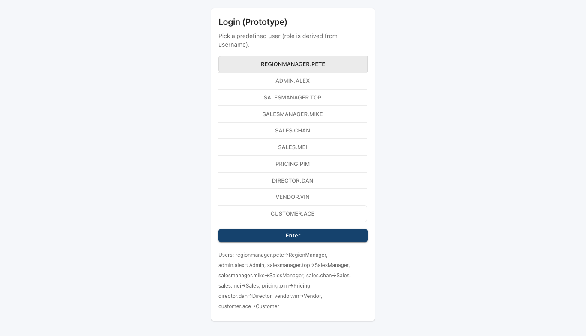

# SharkFin — User Manual (v1.2)

Date: 2025-09-30

This manual helps developers and demoers run SharkFin locally, exercise key workflows, and verify role-based UI behaviors (for example: Sales vs Pricing visibility on Sell/Cost/Margin columns).

Quick verification (Sell column visibility)
1. Start the dev server:

   npm install
   npm run dev

2. Open the app in your browser and login as a Sales user (e.g. `sales.chan`) or Sales Manager (`salesmanager.top`).

3. Navigate to `Inquiry Cart` (menu) and verify the matched rates table shows the `Sell` column when logged in as Sales/SalesManager.

  Example captures (SalesManager):

  

  
Inquiry Cart as Sales Manager — matched rates table with Sell/ROS visible.

  

  
Quotation Edit — Sell column and controls visible to SalesManager.

  

  
Bundled Rates — view of combined/bundled rates used in carts.

4. To verify role differences, login as `customer.ace` — the Sell column should be hidden for customers where appropriate.

Running the screenshot helper
- The project includes `scripts/screenshot.cjs` which uses Puppeteer to capture a few pages for demos. Example:

  BASE_URL=http://localhost:5175 node scripts/screenshot.cjs

  (If Vite started on a different port, adjust BASE_URL accordingly.)

Core sections
- Getting started and run commands
- Login and demo users
- Main workflows (Inquiry, Inquiry Cart, Pricing Requests, Quotations, Rate Management)
- Tariff Surcharges rules & seeding
- Settings and ROS bands
- Troubleshooting

Screenshots
- Captured images are placed under `public/manual/assets/` and named like `inquiry-cart-salesmanager.png`. Use these in the manual or demo slides.

Permission model
- Role-based checks live in `src/permissions.js`. When updating UI visibility, prefer the helpers (`hideCostFor`, `hideRosFor`, `hideSellFor`) instead of in-line role checks.

Known caveats
- Data stored in localStorage — clear with care.
- Puppeteer is only for local tooling; CI environments may need a different approach.

See the remainder of the original manual below for step-by-step instructions and deeper explanations of each screen.

## Run locally

Prereqs: Node.js 18+ and npm.

- Install deps: npm install
- Start dev server: npm run dev
- Open the local URL shown by the dev server (typically http://localhost:5173/)

Optional:
- Tests: npm test
- Build: npm run build; preview (dev server): npm run preview
- Preview production build (SPA fallback): npm run preview-dist

## Login and rolesv

Use any of the demo accounts on the Login screen. Role is derived from username.

- Sales: sales.chan, sales.mei
- Pricing: pricing.pim
- Director: director.dan
- Region Manager: regionmanager.pete
- Sales Manager: salesmanager.top, salesmanager.mike
- Vendor: vendor.vin (linked to a single carrier)
- Customer: customer.ace
- Admin: admin.alex

Tips:
- Switch roles by logging out (top-right) and logging back in with another username.
- Your role controls the menu and which records you can see/edit.

## Navigation by role

- Sales
  - Inquiry Cart, Inquiry Management, Quotations, Quotation Templates
  - Pricing Requests (read) inbox
  - Local Charges, Tariff Surcharges (read)
- Pricing
  - All Sales items plus: Pricing Requests (full), Rate Management, Bundled Rates, Dashboards, Tariff Surcharges
  - Airline Rate Entry via Air tab in Rate Management
- Director
  - Full read across data; Settings, Dashboards
- Vendor
  - Vendor RFQs only (respond with quotes; vendor can view only own quotes)
- Customer
  - Quotations list tailored to the customer

Note: Rate Management 2 is not in the menu (route remains for internal access).

## Core workflows

### 1) Create and manage an Inquiry (Sales)
- Go to Inquiry Management → New (or use Inquiry Cart to stage lanes first).
- Fill header fields (customer, lanes basic info). Owner is auto-filled for Sales.
- From Inquiry Edit you can:
  - Request Better Rate (per-line or bulk) → creates Pricing Requests and sets status to Sourcing.
  - View snapshots of line items if present.

### 2) Build with Inquiry Cart & Cart Detail
- Inquiry Cart: add/compose matched rates into a cart for quoting. Columns are normalized across modes.
- Inline edit Sell and Margin; helper buttons adjust to reach auto-approve ROS.
- Charge Code appears at rightmost for consistency. Cost/ROS columns are hidden in Sales’ matched rates table to keep focus on selling.

### 3) Pricing Requests lifecycle (Pricing, Sales)
- Inbox: Pricing Requests (NEW → RFQ SENT → QUOTES IN → PRICED → REPLIED).
- Send RFQ: pick vendors; vendor quote table appears only after RFQ Sent.
- Import or type vendor quotes; draft Save Progress anytime.
- Mark Priced: freezes a snapshot; Publish to Sales creates rate versions back in the Inquiry and notifies Sales.
- Sales visibility: Sales only see their own requests; Pricing sees all; Vendors see only RFQs they’re invited to and only their own quotes.

### 4) Create and manage a Quotation
- Quotations → New or open from a linked Inquiry.
- Lines: origin/destination, vendor, carrier, unit/container, qty, sell, discount, margin; ROS auto-calculated and color‑coded.
- Additional charges: add reusable templates via Quotation Templates.
- Auto status: if total ROS ≥ 15% the quotation saves as approve; else you can Request Approval (UI placeholder).
- Sales-only owner rule: new quotes auto-assign salesOwner.

### 5) Manage Rates and Airline Rate Entry
- Rate Management tabs: Sea FCL/LCL, Air, Transport, Customs.
- Air tab actions:
  - Edit → opens Airline Rate Entry for the selected sheet.
  - Add → opens a blank Airline Rate Entry sheet.
- Rates feed Inquiry Cart and other consumers via a unified model.

### 6) Tariff Surcharges (Carrier-linked only)
Use Tariff Surcharges to maintain carrier-specific, pattern‑matched surcharges separate from Local Charges.

Rules:
- Carrier is required and must be specific (no "ALL").
- Optional tradelane pattern with wildcards on either side: examples: ALL/ALL, ALL/US*, THLCH/ALL, explicit ORG → DEST.
- Optional equipment match (use ALL to apply to any equipment). Basis, currency, amount required; active flag controls application.

Seeding & persistence controls:
- Seed Samples: one-time demo rows for carriers (ALL/ALL and ALL/US* patterns) plus THB documentation fees per carrier.
- Reset & Seed: clear and reseed samples.
- Link File: choose a JSON file to persist surcharges using the browser File System Access API.
- Save, Load, Autosave: manage the linked JSON file. Autosave writes on changes.
- Changes broadcast via events for multi-tab updates.

Where they apply:
- Surcharges auto-match to rate rows only when carrier is an exact match and tradelane/equipment patterns match.

### 7) Local Charges (Generic tariffs)
- Use Local Charges for generic accessorials not tied to a specific carrier.
- Keep carrier-linked surcharges in Tariff Surcharges only (enforced by validation/migration).

### 8) Settings (Director)
- Adjust ROS bands and auto-approve threshold.
- Affects color chips and auto-approve behavior in Quotations and helper buttons in the cart.

### 9) Audit & Notifications
- Audit Trail Viewer (top bar) shows a prototype log (not exhaustive).
- Notifications (bell icon) display recent pricing updates relevant to the logged-in user; mark all read.

### 10) Vendor RFQs (Vendor)
- Login as vendor.vin. See only Vendor RFQs.
- Upload quotes (CSV) or enter values; vendor sees only own quotes, not competitors.

## Data persistence & backup
- Default storage is browser localStorage. Clearing it removes your data for this origin.
- Surcharges can be persisted to a JSON file when you Link File. You may need to re‑grant access after browser restarts.
- Some screens provide export/import of JSON; CSV/XLSX flows are not implemented.

## Deployment notes (for demo)
- GitHub Pages: app is hosted at /shark-fin; deep links may need navigating from the root due to static hosting limitations.
- Azure Static Web Apps: SPA rewrites enable deep‑linking (e.g., /tariffs). The app base path is environment-driven in builds.

## Troubleshooting
- 404 on deep-link (GitHub Pages): go to the root app URL, then navigate via the menu.
- Blank or missing assets: ensure you’re using the correct base URL for the environment.
- Surcharges file autosave not working: re‑Link File to grant permission.
- Data missing after refresh: your localStorage was cleared; reseed via Tariff Surcharges → Seed Samples.
- Access denied: check your role; switch user via Logout → Login.

## Known limitations
- Prototype only: client-side auth and storage; no backend.
- No concurrency, pagination, or robust audit. IDs are mostly random except Pricing Request IDs.
- Multi-currency and advanced contract logic are out of scope in this version.

---
For deeper requirement details, see BRD.md in the repository.

## Screenshots & walkthrough (optional)

You can add screenshots or a short GIF tour to make demos smoother. Drop assets under `public/manual/` and reference them here. Suggested flow:

1) Login
- 

2) Inquiry Management
- 
- 

3) Pricing Requests
- 
- 

4) Quotation
- 

5) Rate Management & Air Entry
- 
- 

6) Tariff Surcharges
- 

7) Quick Tour (GIF)
- 

Note:
- Files in `public/` are served at the app root. When deployed, use absolute `/manual/...` URLs if needed.

## Role capabilities & permission helper

This section summarizes what each role can see and do in the UI, and documents the centralized permission helper used across the codebase.

- Sales
  - Primary UI: Inquiry Cart (landing page), Inquiry Management, Quotations, Quotation Templates.
  - Cannot view cost or margin columns anywhere in the UI. ROS (Return on Sell) is hidden for Sales.

- SalesManager
  - Same navigation and actions as Sales.
  - Can view ROS in Inquiry and Quotation screens, but still cannot view cost or margin.

- RegionManager
  - Same navigation and actions as Sales/SalesManager (region-level visibility and owner/teams).
  - Can view ROS in Inquiry and Quotation screens (same as SalesManager), but cannot view cost or margin.

- Customer
  - Can access Inquiry Cart and Inquiry Management and view quotations tailored to the customer.
  - Cannot view internal costing or margin data; ROS visibility follows Sales rules (hidden).

- RegionManager
  - Can access Inquiry Cart and Inquiry Management and view quotations for their region.
  - Cannot view internal costing or margin data; ROS visibility follows SalesManager rules (visible).

- Pricing
  - Full access to pricing requests, rate management, and vendor RFQs.
  - Can view costs and ROS for pricing purposes.

- Vendor
  - Access limited to Vendor RFQs and own quotes.
  - Cannot see other vendors' quotes or internal costs.

- Admin
  - Global administration role. Can view and edit user role overrides via User Management (Admin → User Management).
  - Admins can view cost, margin, and ROS across the app for diagnostics and support.

Permission helper
- A centralized helper lives in `src/permissions.js` and exports functions used across components:
  - `canViewCost(user)` — true when the given user role is allowed to see cost/margin columns (e.g., Pricing, Director).
  - `canViewRos(user)` — true when the given user role is allowed to see ROS (e.g., Pricing, Director, SalesManager).
    - `canViewRos(user)` — true when the given user role is allowed to see ROS (e.g., Pricing, Director, SalesManager, RegionManager).
  - `hideCostFor(user)` / `hideRosFor(user)` — convenience inversions used by tables/components.

Use these helpers when adding or changing UI elements that must respect role-based visibility. This keeps role logic centralized and easier to audit or update.

Screenshots added for the manual (replace placeholders with real captures):

- Inquiry Cart: `public/manual/assets/inquiry-cart.png`
- Quotation Edit: `public/manual/assets/quotation-edit.png`
- Bundled Rates: `public/manual/assets/bundled-rates.png`

## Captured screenshots (SalesManager)

The following screenshots were captured for the `salesmanager.top` user. They are useful for the user manual walkthrough and quick visual verification of role-based UI.

- `public/manual/assets/inquiry-cart-salesmanager.png`
  - Caption: Inquiry Cart as Sales Manager — owner pre-filled, matched rates table visible, ROS column displayed per SalesManager permissions.

- `public/manual/assets/inquiry-management-salesmanager.png`
  - Caption: Inquiry Management — pipeline filters and owner column visible for SalesManager.

- `public/manual/assets/quotations-salesmanager.png`
  - Caption: Quotations list view — draft quotations, ROS column and controls accessible to SalesManager.

- `public/manual/assets/quotation-templates-salesmanager.png`
  - Caption: Quotation Templates editor — SalesManager can create and manage pricing templates.

- `public/manual/assets/pricing-requests-salesmanager.png`
  - Caption: Pricing Requests inbox — view of the Rate Improvement Requests screen (empty for the demo dataset).

- `public/manual/assets/local-charges-salesmanager.png`
  - Caption: Local Charges list — SalesManager can view local tariffs (costs shown where permitted).

- `public/manual/assets/tariff-surcharges-salesmanager.png`
  - Caption: Tariff Surcharges (carrier-linked) — full list and seed samples visible to SalesManager per configuration.

## Captured screenshots (RegionManager)

- `public/manual/assets/inquiry-cart-regionmanager.png`
  - Caption: Inquiry Cart as Region Manager — owner/region pre-filled, matched rates table visible, ROS column displayed per RegionManager permissions.

- `public/manual/assets/inquiry-management-regionmanager.png`
  - Caption: Inquiry Management — pipeline filters and owner/region column visible for RegionManager.

- `public/manual/assets/quotations-regionmanager.png`
  - Caption: Quotations list view — draft quotations, ROS column and controls accessible to RegionManager.

If you want these screenshots embedded inline in specific walkthrough sections, tell me where to place them and I'll insert the markdown and small captions near the related steps.
